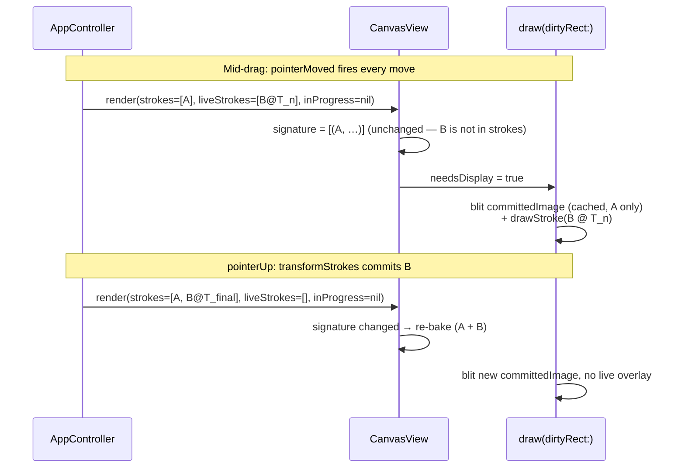

# fiti Architecture

fiti is a hexagonal (ports & adapters) application. The pure Swift **Core** holds the domain model and all behavior; it never references AppKit, Core Graphics, Network, or SwiftUI. The platform-specific **adapters** sit at the edges and translate between Core's ports and the outside world (the OS, the user, the dev HTTP API).

## Module overview

```mermaid
graph LR
    User((User mouse<br/>+ keyboard))
    Claude((Claude / curl<br/>dev HTTP))

    subgraph App["Sources/App (composition root)"]
        Main["main.swift<br/>FitiAppDelegate"]
        Surface["FitiDevHTTPSurface"]
        Args["Args / SystemClock / UUIDStrokeIds"]
    end

    subgraph AppKit["Sources/AppKit (adapters)"]
        Window["TransparentWindow"]
        Canvas["CanvasView"]
        Input["NSEventInputSource"]
        Keys["KeyMonitor"]
        Cursor["CursorRenderer"]
        Toolbar["ToolbarController"]
        Fade["TimerFadeTicker"]
        Stroke["StrokeDrawing<br/>(shared helper)"]
        Hotkeys["KeyboardShortcutsHotkeys"]
    end

    subgraph DevHTTP["Sources/DevHTTP (adapter)"]
        Server["DevHTTPServer<br/>(NWListener)"]
    end

    subgraph Core["Sources/Core (pure Swift, no platform deps)"]
        Controller["AppController<br/>+AutoFade +Commands<br/>+SelectionGesture"]
        Editor["Editor<br/>(subscribe / emit)"]
        Doc["FitiDoc<br/>Stroke / Point / Transform"]
        SelMath["SelectionMath"]
        Ports["Ports: Renderer · WindowControl<br/>InputSource · Clock · IdGenerator<br/>FadeTicker · StationaryDetector<br/>HotkeyRegistry · LaunchAtLogin"]
        Frame["RenderFrame"]
        Inverse["InverseOp"]
    end

    User -->|NSEvent| Input
    User -->|key events| Keys
    User -->|Opt+F system-wide| Hotkeys
    Input -->|onPointer*(modifiers)<br/>onClear/onDeactivate/onUndo/onRedo| Controller
    Keys -->|run(KeyCommand)<br/>currentTool = .selection/.pen| Controller
    Hotkeys -->|onActivation| Controller
    Controller --> Editor
    Controller --> SelMath
    Editor --> Doc
    Editor -.subscribe.-> Frame
    Frame --> Canvas
    Canvas --> Stroke
    Fade -.tick.-> Controller
    Controller -->|setClickThrough/focus| Window
    Controller -->|onCursorChanged| Cursor

    Claude -->|HTTP /pointer /clear /undo| Server
    Server --> Surface
    Surface --> Controller
```

## Ports & adapters

A **port** is a protocol in `Sources/Core/Ports/` that Core depends on. An **adapter** is a concrete type, outside Core, that implements the port using a real platform API. Core never knows the adapter exists — only the protocol.

| Port (Core) | Adapter (AppKit / App) | What it abstracts |
| --- | --- | --- |
| `Renderer` | `CanvasView` (NSView) | Drawing pixels |
| `WindowControl` | `TransparentWindow` (NSWindow) | Click-through, focus, frame |
| `InputSource` | `NSEventInputSource` | In-app mouse + key events; carries `PointerModifiers` (Cmd / Shift) on every pointer event |
| `HotkeyRegistry` | `KeyboardShortcutsHotkeys` | System-wide activation hotkey (Opt+F default, user-rebindable) |
| `Clock` | `SystemClock` | `now()` for stroke timestamps and the fade window |
| `IdGenerator` | `UUIDStrokeIds` | Fresh `StrokeId` per stroke |
| `FadeTicker` | `TimerFadeTicker` | ~30 Hz tick driving the auto-fade ramp |
| `StationaryDetector` | `TaskStationaryDetector` | Hold-to-straighten dwell detection |
| `LaunchAtLogin` | `SMAppServiceLaunchAtLogin` | Login-item registration |
| `DevHTTPSurface` (DevHTTP) | `FitiDevHTTPSurface` (App) | What the dev HTTP server can read/do |

`RenderFrame`, `InverseOp`, and the model types also live under `Sources/Core/` but are plain value types (DTOs), not ports — Core owns them outright.

Two AppKit types are adapters that hold an `AppController` reference and call it directly rather than backing a port: **`KeyMonitor`** (active-app keyboard shortcuts, below) and **`CursorRenderer`** (paints the brush cursor in response to `AppController.onCursorChanged`). They are presentation glue, not abstractions Core depends on.

The composition root is `Sources/App/main.swift` (`FitiAppDelegate`). It is the only file that imports both Core and an adapter module, and it wires the concrete adapters into Core's ports. It also owns a couple of pure-AppKit behaviors that never reach Core — notably **multi-monitor follow**: an observer on the toolbar panel's `didChangeScreenNotification` relocates the full-screen canvas window to whichever display hosts the toolbar (drawings clear on the switch).

Test doubles live under `Tests/CoreTests/Doubles/` (`RecordingRenderer`, `RecordingWindow`, `RecordingFadeTicker`, `RecordingStationaryDetector`, `VirtualClock`, `SeededIdGenerator`, …). Core tests run without AppKit; the build graph enforces this — the `fiti-unit` scheme does not compile `Sources/AppKit` at all, and `just lint` greps `Sources/Core/` to fail any forbidden import.

## Editor and the document model

`Editor` is the single source of truth for the drawing document. It owns a `FitiDoc` (a map of `Stroke` keyed by `StrokeId`, plus an ordered list `strokeOrder`) and exposes the only mutating operations: `startStroke`, `appendPoint`, `endStroke`, `eraseStroke`, `eraseStrokes`, `transformStrokes`, `clear`, `undo`, `redo`.

Every mutation pushes an `InverseOp` onto the undo stack — applied as a *forward edit*, not a history rewind — so the same pattern works whether the backing store stays a Swift struct or is replaced by Automerge later. The cases:

| InverseOp | Pushed by | Undo does |
| --- | --- | --- |
| `deleteStroke(id)` | `startStroke`/`endStroke` | removes the just-added stroke |
| `restoreStroke(snapshot:atIndex:)` | `eraseStroke` | re-inserts one stroke at its old z-index |
| `deleteStrokes([id])` / `restoreStrokes(entries:)` | batch erase paths | removes / re-inserts a set at original z-order |
| `setTransforms(entries:)` | `transformStrokes` | restores each stroke's pre-edit `Transform` |

`transformStrokes(_:)` and `eraseStrokes(ids:)` are batched: one multi-stroke drag or delete is a single undo entry. `applyInverse` is symmetric — applying a `setTransforms` captures the current transforms and returns the inverse, so undo and redo flow through the same code.

Subscribers (`CanvasView`, and in dev mode anything that polls `/state`) get a fresh `RenderFrame` after every mutation, built by `RenderFrame.from(editor:canvasSize:)`. The view never reads Editor internals.

## Modes, tools, and input handling

`AppController` carries two orthogonal pieces of interaction state:

- **`Mode`** — activation state (inactive vs. active). When inactive the overlay is click-through and the cursor is the system arrow. Activation is `Opt+F` (the `HotkeyRegistry` port) or the menubar.
- **`Tool`** — `.pen` (default) or `.selection`, parallel to `Mode` so adding tools doesn't explode the mode enum. Any active mode can host any tool.

**Active-app keyboard shortcuts.** While fiti is active, `KeyMonitor` (an `NSEvent` local monitor on `[.keyDown, .keyUp]`) dispatches single-character keys through the pure-Core `KeyCommandRegistry` → `AppController.run(_:)`. Commands: `1`–`8` pick colors, `s`/`Shift+S` size, `o`/`Shift+O` opacity, `h` hide, `f` auto-fade, `Delete` clear. The registry is the source of truth; the menubar "Drawing" submenu and toolbar tooltips mirror it.

**Space press-and-hold** is the tool switch: Space `keyDown` (ignoring autorepeat) sets `currentTool = .selection`; `keyUp` reverts to `.pen`. Non-Space keyUp events pass straight through.

**Modifier plumbing.** `PointerModifiers` (a Core value type: `command`, `shift`) crosses the boundary so the gesture logic sees Cmd/Shift without Core importing NSEvent. `CanvasInputView` extracts `event.modifierFlags` into one and `NSEventInputSource` forwards it on every `pointerDown/Moved/Up`.

### The selection gesture state machine

`AppController+SelectionGesture` routes pointer events when `currentTool == .selection`. Geometry is pure-Core in `SelectionMath` (`hitTest`, `marqueeHit`, `selectionBounds`) — all of which apply a stroke's `Transform` before computing, so rotated/scaled strokes test correctly.

- **pointerDown** hit-tests. A hit replaces the selection (`selectedStrokeIds = [hit]`) and arms a `.translate` gesture, snapshotting each selected stroke's original transform. `Cmd`-click toggles membership instead. A miss arms a `.marquee`.
- **pointerMoved** updates the live state: a `.translate` writes `inFlightTransforms` (`[StrokeId: Transform]` overlay, computed from the drag delta against the snapshots); a `.marquee` updates `marqueeRect`.
- **pointerUp** commits. `.translate` calls `editor.transformStrokes` (one undo entry) **then** clears `inFlightTransforms`, so the post-commit render reads the new editor state. `.marquee` resolves `SelectionMath.marqueeHit` into `selectedStrokeIds`.

`selectedStrokeIds`, `inFlightTransforms`, and `marqueeRect` each publish on change; `main.swift` subscribes to push selection bounds and the live frame to the canvas. `Delete` with a non-empty selection erases only the selection (via `run(.clear)`'s selection-aware branch); with no selection it clears everything. `Cmd+K` always routes through `clear()` directly and wipes everything. Drawing a new pen stroke, auto-fade expiry, and `clear()` all reset `selectedStrokeIds` so the selection chrome never lingers over absent strokes.

Resize (corner handles) and rotate (top handle) are drawn but not yet interactive — that gesture work is the deferred sub-task; it will reuse this same state machine and the live-overlay rendering below.

## The rendering layers

Naive renderers redraw every stroke every frame. With 200 committed strokes and an active drag that's 200 path-stroke ops at 60 Hz. fiti splits drawing into a cached bake plus two live overlays so per-frame cost is independent of the committed-stroke count.

A `RenderFrame` carries three buckets:

- **`strokes`** — committed strokes to bake. During a selection drag this *excludes* the dragged strokes.
- **`liveStrokes`** — in-flight selection strokes, with their override `Transform` applied, drawn live.
- **`inProgress`** — the pen stroke currently being drawn, drawn live.

`CanvasView`:

- **Bakes `strokes` once** into an off-screen `CGImage`, keyed by a *signature* — a list of `(StrokeId, Transform)` pairs (`BakeSignatureEntry`). The transform is part of the key because a committed stroke's transform legitimately changes on a translate commit or an undo/redo, and those must invalidate the bake.
- **Blits the bake, then draws `liveStrokes`, then `inProgress`**, then the selection chrome (box + handles + marquee), every frame.
- **Re-bakes only when the signature changes.** Because dragged strokes live in `liveStrokes` (not `strokes`) for the duration of a drag, the signature is *stable across the whole gesture* — the bake regenerates only at drag start (selected strokes leave the committed set) and at commit (they rejoin with their new transforms). A drag costs N live-stroke redraws per frame, not a full re-bake.



`drawStroke` (shared by `CanvasView` and `SnapshotRenderer`) applies the stroke's `Transform` to the `CGContext` CTM (`translate → rotate → scale`, matching `SelectionMath.transformed`) before filling the perfect-freehand polygon, so a translated/scaled/rotated stroke renders at its transformed position. `SnapshotRenderer` shares `drawStroke` but skips the cache — the snapshot endpoint is rare and can afford a full redraw.

**Retina.** The bake is sized in backing-store pixels (`Int(canvasSize × window.backingScaleFactor)`) and a CTM scale lets `drawStroke` keep working in logical points, so the committed cache is sharp on 2× displays.

**Coordinate gotcha.** The bake `CGContext` is flipped to match `NSView.isFlipped == true` so top-origin input coords draw correctly. The blit (`CGContext.draw(image:in:)`) is **not** `isFlipped`-aware — it lays the image's bottom-left at `rect.origin`. `draw(_:)` saves the GState, applies a local `translate(0, h) + scale(1, -1)` to undo the view flip, blits, and restores. Without this the cache renders upside-down the instant a stroke commits.

## Text geometry (B4)

`TextItem` carries a `bounds: Size` field (local-space layout width and height). This is a derived value -- CoreText could recompute it at any time -- but it is frozen onto the item at commit and travels with the document.

**Why a derived field lives in the document.** Selection hit-testing, marquee intersection, selection-bounds AABB, and the resize handles all need the text rectangle. If `bounds` were absent, each of those code paths would need to call the `TextMeasuring` port. That would push platform I/O into `SelectionMath` and `RenderFrame`, both of which are pure Core. Freezing `bounds` at commit keeps all geometry math O(1) and port-free inside Core -- the same "freeze authored geometry" approach used for stroke point lists.

**How it is set.** `AppController.commitText()` (in `Sources/Core/Control/AppController+TextTool.swift`) calls `textMeasuring.measure(string:fontName:fontSize:)` on the `TextMeasuring` port, then stores the returned `Size` into `TextItem.bounds` before handing the item to `Editor.addItem` or `Editor.replaceItem`. `Editor` never calls the port.

**The port.** `Sources/Core/Ports/TextMeasuring.swift` declares the protocol. `Sources/AppKit/CoreTextMeasurer.swift` implements it with CoreText (`CTLine`/`CTFrame`). Tests use a deterministic monospace fake (`FakeTextMeasurer`) in `Tests/`. Because the port remains wired at the composition root, bounds can be recomputed for any item by calling `measure` again -- for example, after a font substitution or a document migration.

## Dev HTTP surface

`DevHTTPSurface` is a port living in `Sources/DevHTTP/` (no Network deps; just a protocol). `FitiDevHTTPSurface` in `Sources/App/` adapts it onto `AppController`. `DevHTTPServer` is an `NWListener`-backed HTTP/1.1 server that parses requests on its own queue and hops to `MainActor` before invoking the surface — every surface method touches `AppController` / `Editor`, which are `@MainActor`-isolated. The whole DevHTTP path is compiled out of Release builds (`#if DEBUG`), so the shipped binary never links Network or opens a port.

Routes bypass the activation gate (they call `AppController` methods that the input source also calls). That's deliberate: the dev API needs to drive the app whether or not the overlay is focused.
