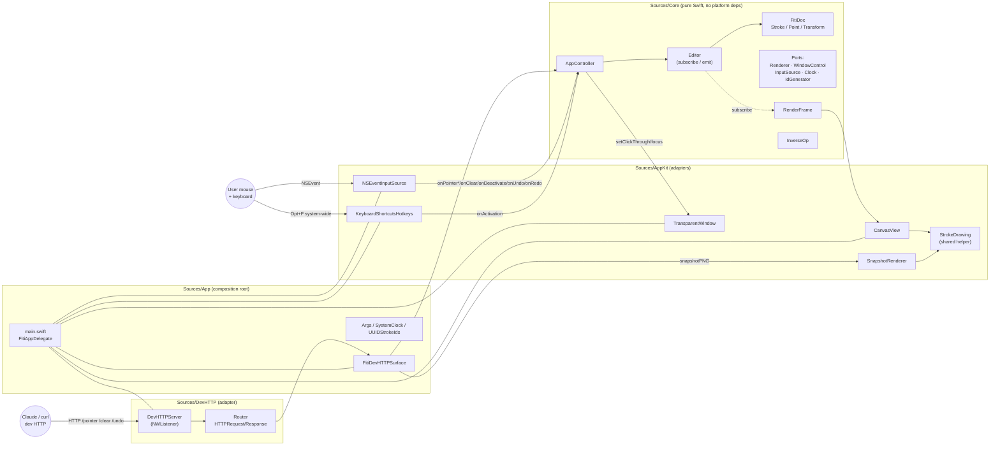
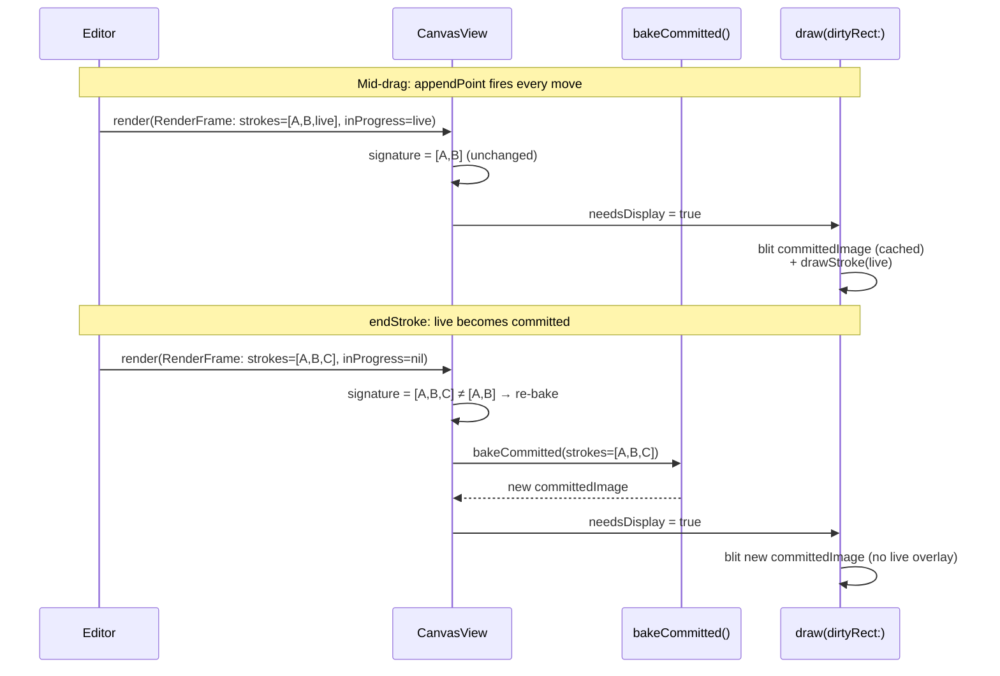

# fiti Architecture

fiti is a hexagonal (ports & adapters) application. The pure Swift **Core** holds the domain model and all behavior; it never references AppKit, Core Graphics, Network, or SwiftUI. The platform-specific **adapters** sit at the edges and translate between Core's ports and the outside world (the OS, the user, the dev HTTP API).

## Module overview

## Ports & adapters

A **port** is a protocol in `Sources/Core/Ports/` that Core depends on. An **adapter** is a concrete type, outside Core, that implements the port using a real platform API. Core never knows the adapter exists — only the protocol.

| Port (Core) | Adapter (AppKit / App) | What it abstracts |
| --- | --- | --- |
| `Renderer` | `CanvasView` (NSView) | Drawing pixels |
| `WindowControl` | `TransparentWindow` (NSWindow) | Click-through, focus |
| `InputSource` | `NSEventInputSource` | In-app mouse + key events (Esc, Cmd+K, Cmd+Z, Cmd+Shift+Z) |
| `HotkeyRegistry` | `KeyboardShortcutsHotkeys` | System-wide activation hotkey (Opt+F default, user-rebindable) |
| `Clock` | `SystemClock` | `now()` for stroke timestamps |
| `IdGenerator` | `UUIDStrokeIds` | Fresh `StrokeId` per stroke |
| `DevHTTPSurface` (DevHTTP) | `FitiDevHTTPSurface` (App) | What the dev HTTP server can read/do |

The composition root is `Sources/App/main.swift`. It is the only file that imports both Core and an adapter module, and it wires the concrete adapters into Core's ports. Swap any adapter (e.g. a Metal-backed `Renderer`, or an in-memory `Clock` for tests) without touching Core.

Test doubles live under `Tests/CoreTests/Doubles/`: `RecordingRenderer`, `RecordingWindow`, `RecordingHotkeyRegistry`, `FixedClock`, `StubIds`. Core tests run without AppKit; the build graph enforces this — the `fiti-unit` scheme does not compile `Sources/AppKit` at all, and `just lint` runs `scripts/check-core-imports.sh` to grep-fail any forbidden import in `Sources/Core/`.

## Editor and the document model

`Editor` is the single source of truth for the drawing document. It owns a `FitiDoc` (a keyed map of `Stroke` keyed by `StrokeId`, plus an ordered list `strokeOrder`) and exposes the only mutating operations: `startStroke`, `appendPoint`, `endStroke`, `eraseStroke`, `clear`, `undo`, `redo`. Every mutation pushes an `InverseOp` onto the undo stack — applied as a *forward edit*, not a history rewind — so the same pattern works whether the backing store stays a Swift struct or is replaced by Automerge later.

Subscribers (currently just `CanvasView` and, in dev mode, anything that polls `/state`) get a fresh `RenderFrame` after every mutation. `RenderFrame` is a flat snapshot — committed strokes in order plus an optional `inProgress` stroke — built by `RenderFrame.from(editor:canvasSize:)`. The view never reads Editor internals.

## The two-canvas split

Naive renderers redraw every stroke every frame. With 200 committed strokes and an active mouse drag, that's 200 path-stroke ops at 60 Hz. The two-canvas split makes per-frame cost independent of the number of committed strokes.

**The idea.** Strokes have two lifetimes. *Committed* strokes are finished — they will not change pixel-for-pixel until they're erased or cleared. *In-progress* strokes change every frame (a new point on every mouse-drag). Treat them differently:

- **Bake the committed strokes once** into an off-screen `CGImage` cache, keyed by the list of committed stroke IDs (the "committed signature").
- **Blit that cache plus the live in-progress stroke** every frame.
- **Re-bake only when the signature changes** — i.e. when a stroke is added to or removed from the committed list. A drag that grows the in-progress stroke does not touch the cache.

**Files.** `CanvasView.render(_:)` does the signature check and decides whether to re-bake. `CanvasView.bakeCommitted(_:exclude:)` builds the off-screen `CGImage`. `CanvasView.draw(_:)` blits the cache then draws the live stroke on top via the shared `drawStroke` helper. `SnapshotRenderer` shares `drawStroke` but does not use the cache — the snapshot endpoint is rare and can afford the full redraw.

**Coordinate gotcha.** The bake is a `CGContext` flipped to match `NSView.isFlipped == true`, so input coords (top-origin from a flipped view's `mouseDown`) draw correctly into the image. The blit (`CGContext.draw(image:in:)`) is **not** `isFlipped`-aware — it always lays the image's bottom-left at `rect.origin`. `CanvasView.draw(_:)` saves the GState, applies a local `translate(0, h) + scale(1, -1)` to undo the view's flip, blits, and restores. Without this you get a vertically mirrored cache (the symptom: drawings flip upside down the instant `endStroke` fires).

**Known limit.** The bake uses `Int(canvasSize.width/height)` pixels — points, not backing-store pixels. On a 2× retina display the cache is half-resolution. The live in-progress stroke is rendered at native resolution by the view context, so there is a subtle sharpness regression on the boundary between committed and in-progress. Fix is straightforward (multiply by `window.backingScaleFactor` in the bake, use a CTM to compensate), deferred until a feature actually needs it.

## Dev HTTP surface

`DevHTTPSurface` is a port living in `Sources/DevHTTP/` (it has no Network deps; it's just a protocol). `FitiDevHTTPSurface` in `Sources/App/` adapts it onto `AppController`. `DevHTTPServer` is an `NWListener`-backed HTTP/1.1 server that parses requests on its own queue and hops to `MainActor` before invoking the surface — because every surface method touches `AppController` / `Editor`, which are `@MainActor`-isolated.

Routes bypass the activation gate (they call `AppController` methods that the input source also calls). That's deliberate: the dev API needs to drive the app whether or not the overlay is focused.
