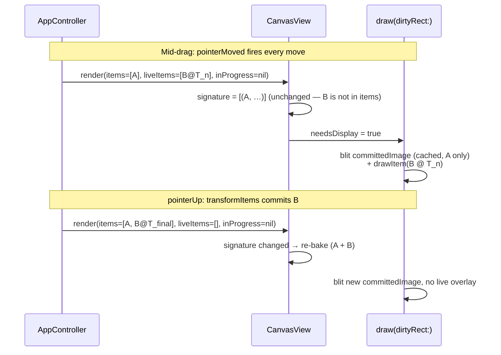

# fiti Architecture

fiti is a hexagonal (ports & adapters) application. The pure Swift **Core** holds the domain model and all behavior; it never references AppKit, Core Graphics, Network, or SwiftUI. The platform-specific **adapters** sit at the edges and translate between Core's ports and the outside world (the OS, the user, the dev HTTP API).

## Module overview

```mermaid
graph LR
    User((User mouse<br/>+ keyboard))
    Claude((Claude / curl<br/>dev HTTP))

    subgraph App["Sources/App (composition root)"]
        Main["main.swift<br/>FitiAppDelegate"]
        Surface["FitiDevHTTPSurface"]
        Args["Args / SystemClock / UUIDItemIds"]
    end

    subgraph AppKit["Sources/AppKit (adapters)"]
        Window["TransparentWindow"]
        Canvas["CanvasView"]
        Input["NSEventInputSource"]
        Keys["KeyMonitor"]
        Cursor["CursorRenderer"]
        Toolbar["ToolbarController"]
        Fade["TimerFadeTicker"]
        Stroke["StrokeDrawing<br/>(shared helper)"]
        Hotkeys["KeyboardShortcutsHotkeys"]
    end

    subgraph DevHTTP["Sources/DevHTTP (adapter)"]
        Server["DevHTTPServer<br/>(NWListener)"]
    end

    subgraph Core["Sources/Core (pure Swift, no platform deps)"]
        Controller["AppController<br/>+AutoFade +Commands +SelectionGesture<br/>+ArrowTool +TextTool"]
        Editor["Editor<br/>(subscribe / emit)"]
        Doc["FitiDoc<br/>CanvasItem (stroke/arrow/text)<br/>keyed by ItemId"]
        SelMath["SelectionMath"]
        Ports["Ports: Renderer · WindowControl<br/>InputSource · Clock · IdGenerator<br/>FadeTicker · StationaryDetector<br/>HotkeyRegistry · LaunchAtLogin"]
        Frame["RenderFrame"]
        Inverse["InverseOp"]
    end

    User -->|NSEvent| Input
    User -->|key events| Keys
    User -->|Opt+F system-wide| Hotkeys
    Input -->|onPointer*(modifiers)<br/>onClear/onDeactivate/onUndo/onRedo| Controller
    Keys -->|run(KeyCommand)<br/>currentTool = .pen/.arrow/.text/.selection| Controller
    Hotkeys -->|onActivation| Controller
    Controller --> Editor
    Controller --> SelMath
    Editor --> Doc
    Editor -.subscribe.-> Frame
    Frame --> Canvas
    Canvas --> Stroke
    Fade -.tick.-> Controller
    Controller -->|setClickThrough/focus| Window
    Controller -->|onCursorChanged| Cursor

    Claude -->|HTTP /pointer /clear /undo| Server
    Server --> Surface
    Surface --> Controller
```

## Ports & adapters

A **port** is a protocol in `Sources/Core/Ports/` that Core depends on. An **adapter** is a concrete type, outside Core, that implements the port using a real platform API. Core never knows the adapter exists — only the protocol.

| Port (Core) | Adapter (AppKit / App) | What it abstracts |
| --- | --- | --- |
| `Renderer` | `CanvasView` (NSView) | Drawing pixels |
| `WindowControl` | `TransparentWindow` (NSWindow) | Click-through, focus, frame |
| `InputSource` | `NSEventInputSource` | In-app mouse + key events; carries `PointerModifiers` (Cmd / Shift) on every pointer event |
| `HotkeyRegistry` | `KeyboardShortcutsHotkeys` | System-wide activation hotkey (Opt+F default, user-rebindable) |
| `Clock` | `SystemClock` | `now()` for stroke timestamps and the fade window |
| `IdGenerator` | `UUIDItemIds` | Fresh `ItemId` per item |
| `FadeTicker` | `TimerFadeTicker` | ~30 Hz tick driving the auto-fade ramp |
| `StationaryDetector` | `TaskStationaryDetector` | Hold-to-straighten dwell detection |
| `LaunchAtLogin` | `SMAppServiceLaunchAtLogin` | Login-item registration |
| `DevHTTPSurface` (DevHTTP) | `FitiDevHTTPSurface` (App) | What the dev HTTP server can read/do |

`RenderFrame`, `InverseOp`, and the model types also live under `Sources/Core/` but are plain value types (DTOs), not ports — Core owns them outright.

Two AppKit types are adapters that hold an `AppController` reference and call it directly rather than backing a port: **`KeyMonitor`** (active-app keyboard shortcuts, below) and **`CursorRenderer`**. The cursor is *pure derived state*: `AppController.currentCursor` maps the current mode, tool, hover point, and toolbar region to a `CursorSpec` (brush circle, crosshair, arrowhead, I-beam, or a resize/rotate `SystemCursor`), emitting through `onCursorChanged`; `CursorRenderer` just paints whatever spec it is handed. Hovering the toolbar region yields the system arrow so the toolbar reads as ordinary chrome. They are presentation glue, not abstractions Core depends on.

The composition root is `Sources/App/main.swift` (`FitiAppDelegate`). It is the only file that imports both Core and an adapter module, and it wires the concrete adapters into Core's ports. It also owns a couple of pure-AppKit behaviors that never reach Core — notably **multi-monitor follow**: an observer on the toolbar panel's `didChangeScreenNotification` relocates the full-screen canvas window to whichever display hosts the toolbar (drawings clear on the switch).

Test doubles live under `Tests/CoreTests/Doubles/` (`RecordingRenderer`, `RecordingWindow`, `RecordingFadeTicker`, `RecordingStationaryDetector`, `VirtualClock`, `SeededIdGenerator`, …). Core tests run without AppKit; the build graph enforces this — the `fiti-unit` scheme does not compile `Sources/AppKit` at all, and `just lint` greps `Sources/Core/` to fail any forbidden import.

## Editor and the document model

`Editor` is the single source of truth for the drawing document. It owns a `FitiDoc` (a map of `CanvasItem` keyed by `ItemId`, plus an ordered list `itemOrder`) and exposes the only mutating operations: `startStroke`/`appendPoint`/`endStroke` (the pen), `addItem`/`replaceItem` (arrow and text), `eraseStroke`, `eraseItems`, `transformItems`, `clear`, `undo`, `redo`. A `CanvasItem` is the sum type over `Stroke`, `ArrowItem`, and `TextItem`; everything below that says "item" applies to all three.

Every mutation pushes an `InverseOp` onto the undo stack — applied as a *forward edit*, not a history rewind — so the same pattern works whether the backing store stays a Swift struct or is replaced by Automerge later. The cases:

| InverseOp | Pushed by | Undo does |
| --- | --- | --- |
| `deleteItem(id)` | `startStroke`/`endStroke`, `addItem` | removes the just-added item |
| `restoreItem(snapshot:atIndex:)` | `eraseStroke` | re-inserts one item at its old z-index |
| `deleteItems([id])` / `restoreItems(entries:)` | batch erase paths | removes / re-inserts a set at original z-order |
| `setTransforms(entries:)` | `transformItems` | restores each item's pre-edit `Transform` |
| `replaceItems(entries:)` | `replaceItem` (text edit commit) | restores items' prior full values |

`transformItems(_:)` and `eraseItems(ids:)` are batched: one multi-item drag or delete is a single undo entry. `applyInverse` is symmetric — applying a `setTransforms` captures the current transforms and returns the inverse, so undo and redo flow through the same code.

Subscribers (`CanvasView`, and in dev mode anything that polls `/state`) get a fresh `RenderFrame` after every mutation, built by `RenderFrame.from(editor:canvasSize:overrides:editingItemId:)`. The view never reads Editor internals.

## Modes, tools, and input handling

`AppController` carries two orthogonal pieces of interaction state:

- **`Mode`** — activation state (inactive vs. active). When inactive the overlay is click-through and the cursor is the system arrow. Activation is `Opt+F` (the `HotkeyRegistry` port) or the menubar.
- **`Tool`** — `.pen` (default), `.arrow`, `.text`, or `.selection`, parallel to `Mode` so adding tools doesn't explode the mode enum. Any active mode can host any tool.

**Active-app keyboard shortcuts.** While fiti is active, `KeyMonitor` (an `NSEvent` local monitor on `[.keyDown, .keyUp]`) dispatches single-character keys through the pure-Core `KeyCommandRegistry` → `AppController.run(_:)`. Commands: `1`–`8` pick colors, `p`/`a`/`t` select the pen/arrow/text tool, `s`/`Shift+S` size, `o`/`Shift+O` opacity, `h` hide, `f` auto-fade, `Delete` clear. Size and opacity step through preset values (`ValuePresets`) rather than free-scaling. The registry is the source of truth; the menubar "Drawing" submenu and toolbar tooltips mirror it.

**Space press-and-hold** switches to the selection tool: Space `keyDown` (ignoring autorepeat) sets `currentTool = .selection`; `keyUp` reverts to whichever tool was active before (so Space-from-text returns to text, not pen). It works from pen and text alike; while a text edit session is open, Space is a literal space instead. Non-Space keyUp events pass straight through.

**Modifier plumbing.** `PointerModifiers` (a Core value type: `command`, `shift`) crosses the boundary so the gesture logic sees Cmd/Shift without Core importing NSEvent. `CanvasInputView` extracts `event.modifierFlags` into one and `NSEventInputSource` forwards it on every `pointerDown/Moved/Up`.

### The selection gesture state machine

`AppController+SelectionGesture` routes pointer events when `currentTool == .selection`. Geometry is pure-Core in `SelectionMath` (`hitTestItem`, `marqueeHitItems`, `selectionBoundsItems`, `region`) — all of which apply an item's `Transform` before computing, so rotated/scaled items test correctly.

- **pointerDown** is region-first: `SelectionMath.region` classifies the point against the current `selectionBox` as `.rotateHandle`, `.corner`, `.body`, or `.outside`. Rotate node arms `.rotate`, a corner arms `.resize`, the body arms `.translate`, and `.outside` hit-tests an item — a hit replaces the selection (`selectedItemIds = [hit]`) and arms `.translate`, a miss arms a `.marquee`. Each gesture snapshots the selected items' transforms. `Cmd`-click toggles membership instead; `Cmd`-drag arms an additive marquee.
- **pointerMoved** updates the live state via the pure `SelectionTransforms`: `.translate`/`.resize`/`.rotate` each write `inFlightTransforms` (`[ItemId: Transform]` overlay) and the live `selectionBox`; a `.marquee` updates `marqueeRect`.
- **pointerUp** commits. `.translate`/`.resize`/`.rotate` call `editor.transformItems` (one undo entry) **then** clear `inFlightTransforms`, so the post-commit render reads the new editor state. `.marquee` resolves `SelectionMath.marqueeHitItems` into `selectedItemIds`.

`selectedItemIds`, `inFlightTransforms`, and `marqueeRect` each publish on change; `main.swift` subscribes to push selection bounds and the live frame to the canvas. `Delete` with a non-empty selection erases only the selection (via `run(.clear)`'s selection-aware branch); with no selection it clears everything. `Cmd+K` always routes through `clear()` directly and wipes everything. Drawing a new mark, auto-fade expiry, and `clear()` all reset `selectedItemIds` so the selection chrome never lingers over absent items.

**Resize and rotate are interactive**, routed through `SelectionTransforms` (pure Core): a corner drag scales the selection from the opposite corner as anchor (clamped to a minimum factor), and the rotate node spins the box about its center, with `Shift` snapping to 15° increments. Both preview through `inFlightTransforms` and commit one `transformItems` entry. Rotate keeps the box's angle on commit; translate and resize recompute an upright box.

## The rendering layers

Naive renderers redraw every stroke every frame. With 200 committed strokes and an active drag that's 200 path-stroke ops at 60 Hz. fiti splits drawing into a cached bake plus two live overlays so per-frame cost is independent of the committed-stroke count.

A `RenderFrame` carries three buckets:

- **`items`** — committed items to bake. During a selection drag this *excludes* the dragged items.
- **`liveItems`** — in-flight selection items, with their override `Transform` applied, drawn live.
- **`inProgress`** — the pen stroke or arrow currently being drawn, drawn live.

`CanvasView`:

- **Bakes `items` once** into an off-screen `CGImage`, keyed by a *signature* — a list of `(ItemId, Transform)` pairs (`BakeSignatureEntry`). The transform is part of the key because a committed item's transform legitimately changes on a translate/resize/rotate commit or an undo/redo, and those must invalidate the bake.
- **Blits the bake, then draws `liveItems`, then `inProgress`**, then the selection chrome (box + handles + marquee), every frame.
- **Re-bakes only when the signature changes.** Because dragged items live in `liveItems` (not `items`) for the duration of a drag, the signature is *stable across the whole gesture* — the bake regenerates only at drag start (selected items leave the committed set) and at commit (they rejoin with their new transforms). A drag costs N live-item redraws per frame, not a full re-bake.



`drawItem` (in `StrokeDrawing.swift`, shared by `CanvasView` and `SnapshotRenderer`) dispatches on the `CanvasItem` case to `drawStroke` / `drawArrow` / `drawText`. Each applies the item's `Transform` to the `CGContext` CTM (`translate → rotate → scale`, matching `SelectionMath.transformed`) before drawing — for a stroke, filling the perfect-freehand polygon — so a translated/scaled/rotated item renders at its transformed position. `SnapshotRenderer` shares `drawItem` but skips the cache — the snapshot endpoint is rare and can afford a full redraw.

**Retina.** The bake is sized in backing-store pixels (`Int(canvasSize × window.backingScaleFactor)`) and a CTM scale lets `drawStroke` keep working in logical points, so the committed cache is sharp on 2× displays.

**Coordinate gotcha.** The bake `CGContext` is flipped to match `NSView.isFlipped == true` so top-origin input coords draw correctly. The blit (`CGContext.draw(image:in:)`) is **not** `isFlipped`-aware — it lays the image's bottom-left at `rect.origin`. `draw(_:)` saves the GState, applies a local `translate(0, h) + scale(1, -1)` to undo the view flip, blits, and restores. Without this the cache renders upside-down the instant a stroke commits.

### Opacity flattening

Committed items are grouped into flattened layers by `LayerPlan` (Core, pure): marks of the
same (hue, alpha) merge unless a different key genuinely overlaps between them in draw order,
which preserves cross-color stacking. `GroupCompositor` (AppKit) flattens each group by drawing
its items opaque inside a CGContext transparency layer composited at the group's alpha, clipped
to the group's bounding region so the offscreen is sized to the drawn area rather than the whole
canvas. The committed bake and the snapshot share this routine. The in-progress pen stroke
flattens live: its group's committed members are lifted out of the static bake and cached as an
opaque-union image (rebuilt only when the lifted set changes), and the static bake is split into
the groups below and above the active group, so the live composite (below image, then the
group's union plus the live stroke at the group alpha, then above image) reproduces the
committed z-order while drawing. Auto-fade applies once as a final multiplier.

## Arrow tool

The arrow is a `CanvasItem.arrow(ArrowItem)` case (`Sources/Core/Model/ArrowItem.swift`), not a
`Stroke` with a flag. Being a `CanvasItem` is what earns it selection, move/rotate/resize, the
color/size/opacity restyle shortcuts, undo, and erase with no per-tool code -- the same dividend the
text tool collected when the `CanvasItem` sum type was introduced.

**Shared pure geometry.** `ArrowGeometry.outline` (`Sources/Core/Rendering/ArrowGeometry.swift`,
pure Core) builds one merged shaft+head polygon from the tail, head, and width. A single source of
truth drives both halves of the app: `SelectionMath` uses it for the world AABB and a
point-in-polygon hit-test, and the AppKit renderer `drawArrow` (`Sources/AppKit/ArrowDrawing.swift`)
fills the same polygon as one path with rounded joins. Filling a single merged path (rather than a
shaft plus a separate head) keeps the shaft/head seam from double-darkening under alpha. The head is
a single filled swept shape at the lift point on a subtly tapered shaft; head size scales with the
stroke-width slider. No angle snapping, single-headed only.

**In-progress transient + generalized frame.** While the user drags, the arrow is an `Editor`
transient (`Sources/Core/Editor/Editor+Arrow.swift`: `beginArrow` / `updateArrowHead` /
`commitArrow` / `cancelArrow`) held out of the document until the lift commits it as one undoable op.
To carry it through the live engine, `RenderFrame.inProgress` was generalized from `Stroke?` to
`CanvasItem?`, so the in-progress arrow flows through the same cached-union below/above split and
live flatten the pen stroke uses.

**Flattening and WYSIWYG.** Arrows participate in the existing (hue, alpha) opacity flattening via
`GroupCompositor` exactly like strokes -- overlapping same-color arrows and strokes read flat. Because
`drawArrow` ignores the in-progress flag, the live in-progress arrow is pixel-identical to its
committed form, verified by `Tests/AppKitTests/ArrowFlattenTests.swift`. The inherited limits of the
flattening design (cross-hue-conflict darkening, AABB conservatism) apply to arrows unchanged.

## Text geometry (B4)

`TextItem` carries a `bounds: Size` field (local-space layout width and height). This is a derived value -- CoreText could recompute it at any time -- but it is frozen onto the item at commit and travels with the document.

**Why a derived field lives in the document.** Selection hit-testing, marquee intersection, selection-bounds AABB, and the resize handles all need the text rectangle. If `bounds` were absent, each of those code paths would need to call the `TextMeasuring` port. That would push platform I/O into `SelectionMath` and `RenderFrame`, both of which are pure Core. Freezing `bounds` at commit keeps all geometry math O(1) and port-free inside Core -- the same "freeze authored geometry" approach used for stroke point lists.

**How it is set.** `AppController.commitText()` (in `Sources/Core/Control/AppController+TextTool.swift`) calls `textMeasuring.measure(string:fontName:fontSize:)` on the `TextMeasuring` port, then stores the returned `Size` into `TextItem.bounds` before handing the item to `Editor.addItem` or `Editor.replaceItem`. `Editor` never calls the port.

**The port.** `Sources/Core/Ports/TextMeasuring.swift` declares the protocol. `Sources/AppKit/CoreTextMeasurer.swift` implements it with CoreText (`CTLine` + `CTLineGetTypographicBounds`). Tests use a deterministic monospace fake (`FakeTextMeasurer`) in `Tests/`. Because the port remains wired at the composition root, bounds can be recomputed for any item by calling `measure` again -- for example, after a font substitution or a document migration.

## Geometry glossary

Three terms appear throughout the selection and rendering code. They are closely related but distinct.

**Bounding box** -- a rectangle that encloses a shape. The generic term; the variants below are specific kinds.

**AABB (axis-aligned bounding box)** -- the smallest upright rectangle (sides parallel to the screen x and y axes) that fully encloses a shape. Computed from the min/max x and y of a shape's transformed points or box corners. Used in `SelectionMath` for marquee intersection tests (`marqueeHit`) and for computing the initial selection bounds (`selectionBounds`). Because it is always upright, a rotated item's AABB is larger than the item itself -- it is the upright rectangle that wraps the item's tilted outline.

**Oriented box (`OrientedBox`)** -- a rectangle that can be rotated to hug a tilted item. Defined in `Sources/Core/Selection/OrientedBox.swift`. Used for the selection chrome (the dashed border and resize/rotate handles drawn around a selected item) and for hit-testing a rotated item. Unlike an AABB, an oriented box shares the item's rotation, so it wraps the item tightly even when the item is at an angle. The same oriented box that drives hit-testing drives the rendered chrome, keeping the two consistent.

The upright-vs-tilted distinction matters in practice: hit-testing a rotated stroke against its AABB produces false positives in the corners that fall outside the actual stroke. `SelectionMath` avoids this by transforming candidate points into the item's local space before testing, which is equivalent to testing against the oriented box.

## Dev HTTP surface

`DevHTTPSurface` is a port living in `Sources/DevHTTP/` (no Network deps; just a protocol). `FitiDevHTTPSurface` in `Sources/App/` adapts it onto `AppController`. `DevHTTPServer` is an `NWListener`-backed HTTP/1.1 server that parses requests on its own queue and hops to `MainActor` before invoking the surface — every surface method touches `AppController` / `Editor`, which are `@MainActor`-isolated. The whole DevHTTP path is compiled out of Release builds (`#if DEBUG`), so the shipped binary never links Network or opens a port.

Routes bypass the activation gate (they call `AppController` methods that the input source also calls). That's deliberate: the dev API needs to drive the app whether or not the overlay is focused.
