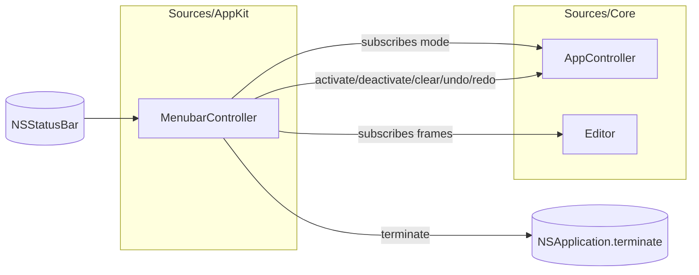

# fiti Menubar (Design)

Date: 2026-05-16
Status: Design — awaiting review before implementation plan.

## Goal

Give fiti a visible, persistent presence in the macOS menu bar so users can:

1. Tell at a glance whether fiti is running and whether it's actively capturing input.
2. Quit fiti from a UI control (not `just stop`, not `pkill`).
3. Reach the existing actions — activate, deactivate, clear, undo, redo — without having to remember keyboard shortcuts.

This is the first user-facing surface beyond the transparent overlay itself. It is intentionally narrow — the floating toolbar (color, width, opacity, tool picker) lives in a separate later spec.

## Out of scope

- Color, width, opacity controls (those live on the floating toolbar)
- Hide / show drawings (separate roadmap item; the menubar adds the menu entry when that feature lands)
- Tool picker (pen / eraser / shapes)
- Preferences window
- A Dock icon (`LSUIElement = true` stays — the menubar IS the user-facing presence)

## UX

The menubar status item is always visible while fiti is running. Click it to open the menu:

```
┌──────────────────────────┐
│ Activate          ⌘⌥Z    │  (enabled when inactive)
│ Deactivate        esc    │  (enabled when active)
│ ─────                    │
│ Clear             ⌘K     │  (always enabled)
│ Undo              ⌘Z     │  (enabled when undoDepth > 0)
│ Redo              ⇧⌘Z    │  (enabled when redoDepth > 0)
│ ─────                    │
│ Quit fiti         ⌘Q     │
└──────────────────────────┘
```

Icon state:
- **Inactive** (click-through, doing nothing): `theatermask.and.paintbrush` (outlined SF Symbol)
- **Active** (capturing input, drawing or idle): `theatermask.and.paintbrush.fill` (filled SF Symbol)

Both rendered as template images so macOS tints them to the menubar text color (white on dark menu bar, black on light). No tinting from our side; relying on system convention.

Behavioral notes:
- Activate / Deactivate items are *both shown* with one enabled at a time, rather than a single toggling label. Each has its own keyEquivalent so the keyboard shortcut hint is correct in either state.
- The keyEquivalents in the menu are *display* labels only for `Esc`, `Cmd+Opt+Z`, and `Cmd+K` — the actual keys are already handled by `NSEventInputSource`'s local and global monitors. macOS will not double-fire because menu keyEquivalents only fire when the app is key, and the local monitor consumes (returns `nil` from) the event in that case.
- `Cmd+Z` / `Shift+Cmd+Z` for undo/redo are new keyboard bindings. They only fire when fiti is the key application (i.e. during `.activeIdle` or `.activeDrawing`). When fiti is click-through they pass through to whatever app is focused — exactly what we want.
- `Cmd+Q` for quit is new; same scoping.

## Architecture

The menubar is a pure adapter. No new port is added; the controller it drives (`AppController`) and the document it queries (`Editor`) already expose everything needed.



One small Core addition is required: `AppController` needs to publish mode changes so the icon can react in real time.

### Core change: `AppController.onModeChanged`

```swift
public final class AppController {
    public var onModeChanged: ((Mode) -> Void)?

    public private(set) var mode: Mode = .inactive {
        didSet {
            if oldValue != mode { onModeChanged?(mode) }
        }
    }
    // ... rest unchanged
}
```

`didSet` on the property means every transition (`.inactive` → `.activeIdle`, `.activeIdle` → `.activeDrawing`, `.activeDrawing` → `.activeIdle`, anything → `.inactive`) automatically publishes. Single emission point, no scattered `onModeChanged?(...)` calls.

The menubar adapter collapses `.activeIdle` and `.activeDrawing` into "active" for icon purposes:

```swift
private func isActive(_ mode: AppController.Mode) -> Bool {
    mode != .inactive
}
```

Single subscriber today. If we ever need multiple, we promote `onModeChanged` to a `subscribe(...) -> Cancellable` pattern matching `Editor.subscribe`. Not worth the indirection now.

### Adapter: `Sources/AppKit/MenubarController.swift`

```swift
@MainActor
public final class MenubarController {
    private let controller: AppController
    private let editor: Editor
    private let statusItem: NSStatusItem
    private let menu: NSMenu
    private var editorSubscription: Cancellable?
    private var activateItem: NSMenuItem!
    private var deactivateItem: NSMenuItem!
    private var undoItem: NSMenuItem!
    private var redoItem: NSMenuItem!

    public init(controller: AppController, editor: Editor) {
        self.controller = controller
        self.editor = editor
        self.statusItem = NSStatusBar.system.statusItem(withLength: NSStatusItem.variableLength)
        self.menu = NSMenu()
        buildMenu()
        statusItem.menu = menu
        menu.delegate = self  // NSMenuDelegate
        updateIcon(for: controller.mode)
        controller.onModeChanged = { [weak self] mode in self?.updateIcon(for: mode) }
    }
    // ...
}
```

`NSMenuDelegate.menuNeedsUpdate(_:)` recomputes enabled state for Activate / Deactivate / Undo / Redo right before the menu opens. Cheap (a few comparisons + a `editor.canUndo` check) and avoids burning cycles on every Editor frame.

The Editor subscription is not strictly required for menu correctness (we compute on `menuNeedsUpdate`), but it keeps the icon's responsiveness honest if we ever surface anything else. Acceptable to skip; we'll start without it and add only if a real need arrives.

### Wiring in `main.swift`

One new line in `FitiAppDelegate.applicationDidFinishLaunching`:

```swift
menubar = MenubarController(controller: controller, editor: editor)
```

`menubar` is stored as a property on the delegate so it's not deallocated. `NSStatusBar` retains the status item, but `NSStatusItem` does not strong-ref its `menu` delegate — so the delegate (our `MenubarController`) must be kept alive by the app delegate.

## Implementation details

### Menu construction

```swift
private func buildMenu() {
    activateItem    = item("Activate",    "z", [.command, .option], #selector(activate))
    deactivateItem  = item("Deactivate",  "\u{1b}", [],              #selector(deactivate))
    let clearItem   = item("Clear",       "k", [.command],           #selector(clearAll))
    undoItem        = item("Undo",        "z", [.command],           #selector(undo))
    redoItem        = item("Redo",        "z", [.command, .shift],   #selector(redo))
    let quitItem    = item("Quit fiti",   "q", [.command],           #selector(quit))

    [activateItem, deactivateItem, .separator(),
     clearItem, undoItem, redoItem, .separator(),
     quitItem].forEach { menu.addItem($0) }
}
```

The `item(...)` helper produces an `NSMenuItem` with `target = self` so actions land on the `MenubarController`.

`"\u{1b}"` is the Escape character literal. The empty modifier mask + Esc as keyEquivalent will display "esc" in the menu and only fire when fiti is key (same scope as the existing local monitor — they do not race because the local monitor returns `nil` to swallow Esc before menu key matching runs).

### Icon update

```swift
private func updateIcon(for mode: AppController.Mode) {
    let name = isActive(mode) ? "theatermask.and.paintbrush.fill"
                              : "theatermask.and.paintbrush"
    let image = NSImage(systemSymbolName: name, accessibilityDescription: "fiti")
    image?.isTemplate = true
    statusItem.button?.image = image
}
```

### `menuNeedsUpdate`

```swift
extension MenubarController: NSMenuDelegate {
    public func menuNeedsUpdate(_ menu: NSMenu) {
        let active = isActive(controller.mode)
        activateItem.isEnabled   = !active
        deactivateItem.isEnabled = active
        undoItem.isEnabled       = editor.canUndo
        redoItem.isEnabled       = editor.canRedo
    }
}
```

`Editor.canUndo` / `canRedo` are not yet exposed publicly (they are accessible via `undoDepth > 0` / `redoDepth > 0` on the DevHTTP surface). We add them as computed properties on `Editor` — trivial change, surfaces what's already there.

### Action selectors

```swift
@objc private func activate()   { controller.activate() }
@objc private func deactivate() { controller.deactivate() }
@objc private func clearAll()   { controller.clear() }
@objc private func undo()       { _ = editor.undo() }
@objc private func redo()       { _ = editor.redo() }
@objc private func quit()       { NSApplication.shared.terminate(nil) }
```

## Testing strategy

### Core (`Tests/CoreTests`)

New tests in `AppControllerTests`:

```swift
@Test("activate publishes .activeIdle")
@Test("deactivate publishes .inactive")
@Test("pointerDown publishes .activeDrawing")
@Test("pointerUp publishes .activeIdle")
@Test("no callback fires when the mode does not actually change")
```

All exercise the `didSet` path through a captured closure. No AppKit, no NSStatusBar.

New Editor surface check:

```swift
@Test("canUndo / canRedo reflect stack depth")
```

### AppKit (`Tests/AppKitTests`, runs under `fiti-integration`)

```swift
@Test("menu has the expected items in the expected order")
@Test("icon swaps to .fill when mode becomes active")
@Test("icon returns to outline when mode becomes inactive")
@Test("activateItem.isEnabled flips with mode after menuNeedsUpdate")
@Test("undoItem.isEnabled tracks editor.canUndo after menuNeedsUpdate")
```

These instantiate `MenubarController` with a real `AppController` + `Editor` and a recording `WindowControl` double. They do not exercise actually clicking on the menubar (that requires running the app) but they exercise every code path that matters.

## Open questions

1. **Should the activation menu items show the keyboard hint even when greyed out?** I think yes — the hint is informational regardless of enabled state, and seeing it stays useful for muscle memory. (macOS does this by default; calling out so it doesn't surprise us later.)

2. **What should clicking `Quit fiti` do mid-stroke?** Drop the in-progress stroke. A stroke is not committed until `pointerUp` / `endStroke` — quitting mid-drag should lose the still-uncommitted points. No `applicationShouldTerminate` hook needed; `NSApplication.terminate(_:)` is sufficient. (Once persistence lands, the committed strokes will be saved by then; only the unfinished one is discarded.)

3. **Does adding `Cmd+Z` undo via menu keyEquivalent create any expectation that undo persists after activation/deactivation?** No — both the undo/redo stacks and the document state are owned by `Editor`, which outlives mode changes. Activate/deactivate touches neither. The implementation matches the original spec faithfully (and matches `../scratch/scratch` for reference): `InverseOp` records are immutable value types, but the stacks themselves are mutable arrays (`Editor.swift:15-16`), and undo is forward-applied — `undo()` pops an `InverseOp` from `undoStack`, applies it as a forward edit, and pushes the resulting inverse onto `redoStack`. Note for later: neither stack persists across an app restart today, which is consistent with the document state also not persisting; both questions get answered together in the Persistence roadmap item.

## What this unlocks

After this lands:
- A user can see fiti running without `pgrep`.
- A user can quit fiti without `just stop`.
- A user can undo/redo with the keyboard while drawing (Cmd+Z / Shift+Cmd+Z) — bonus that falls out of the menu binding.
- The floating toolbar in a later spec can reuse the same `controller.onModeChanged` hook to show/hide itself.
