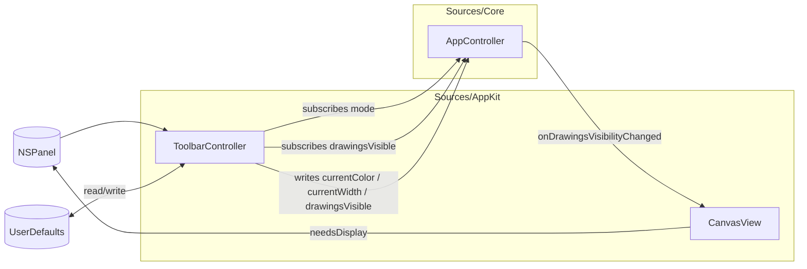

# fiti Toolbar (Design)

Date: 2026-05-17
Status: Design — awaiting review before implementation plan.

## Goal

A floating, vertical toolbar that gives the user pen-and-color controls without leaving the overlay. Lands the first user-facing control surface after the menubar; the menubar handles state + admin actions (activate/quit), the toolbar handles drawing parameters (color/width/opacity/visibility).

## Scope

In:
- Vertical floating panel that appears when fiti activates, hides when fiti deactivates
- Pen tool button (only tool for v1 — visual placeholder for the post-v1 eraser / shape tools)
- 8 quick-pick colors (the palette from `../scratch/scratch/packages/web/src/ui/Toolbar.tsx`)
- Custom color picker via `NSColorWell`
- Width slider (1–20)
- Opacity slider (0–100%)
- Hide/Show drawings button (toggles whether existing strokes are rendered, without erasing them)
- Position persists across launches (`NSWindow.setFrameAutosaveName`)
- Color / width / opacity persist across launches (`UserDefaults`)

Out:
- Eraser tool button (data path already works via HTTP; UI lands in a follow-up)
- Clear / undo / redo buttons (menubar handles those)
- Shape tools (rect / ellipse / arrow)
- Tool picker dropdown / submenu
- Global Cmd+Opt+H hotkey for hide/show (toolbar button is the only surface for v1)
- Hide/show state persistence — fresh launches always start visible
- Snap-to-edges, resizable panel
- Multi-display toolbar replication (single panel on the main display only)

## UX

When fiti activates (Cmd+Opt+Z or the menubar's Activate item), the toolbar appears at its remembered position. On first launch, the toolbar's frame autosave restores nothing, so it defaults to the bottom-left corner of the main display.

Vertical layout, top to bottom:

```
 ┌───┐
 │[✎]│   pen tool (single button, visually "selected")
 │   │
 │● ●│   8 quick-pick colors in a 2×4 grid
 │● ●│
 │● ●│
 │● ●│
 │[🎨]│  custom color picker (NSColorWell)
 │ w │   width slider (1–20)
 │[─●]│
 │ o │   opacity slider (0–100%)
 │[─●]│
 │[👁]│  hide/show drawings toggle
 └───┘
```

- Clicking a quick-pick color sets the stroke RGB but **preserves the current alpha** (so red-50% stays red-50%, not red-100%).
- The opacity slider only writes the alpha channel. Color and opacity are decoupled in the UI; in the model they combine as a single `RGBA`.
- The hide/show button glyph toggles between `eye` and `eye.slash` to indicate state. Clicking it sets `AppController.drawingsVisible`; `CanvasView.draw(_:)` short-circuits when false (no blit, no in-progress overlay). Strokes stay in the document.
- Esc deactivates → toolbar hides along with the cursor capture.
- The toolbar is drag-positionable via the panel's title bar (which we'll style minimally; AppKit handles drag for free).
- The panel is `nonactivatingPanel` style so clicking widgets does not steal focus from the underlying app you're presenting against. Window level is `.floating` so it stays above normal app windows.

## Architecture

Pure adapter, mirroring the menubar pattern. No new ports. Two small Core additions for the visibility state and one for live opacity:



### Core changes

**`AppController.swift`:**

```swift
public var onDrawingsVisibilityChanged: ((Bool) -> Void)?

public var drawingsVisible: Bool = true {
    didSet {
        if oldValue != drawingsVisible { onDrawingsVisibilityChanged?(drawingsVisible) }
    }
}
```

Mirror of the `onModeChanged` pattern already established. Single emission point via `didSet`.

`currentColor: RGBA` and `currentWidth: Double` already exist as `public var`s. The toolbar writes them directly; no callback needed since the only reader (the in-progress stroke construction in `startStroke`) reads them at stroke-start time, not reactively.

### CanvasView change

`CanvasView.draw(_:)` currently always blits the cached image and the in-progress stroke. Add an early return:

```swift
public override func draw(_ dirtyRect: NSRect) {
    guard let ctx = NSGraphicsContext.current?.cgContext, let frame = lastFrame else { return }
    guard drawingsVisible else { return }  // NEW: short-circuit when hidden
    // ... existing draw logic
}
```

`CanvasView` gets a `var drawingsVisible: Bool = true` of its own (kept in sync via the AppController callback, or pushed by main.swift wiring). Main.swift's existing `editor.subscribe { ... canvas.render(...) }` already covers normal redraws; we just need a separate path for the visibility flip. Easiest: hook `controller.onDrawingsVisibilityChanged` to update `canvas.drawingsVisible` and call `canvas.needsDisplay = true`.

### Adapter: `Sources/AppKit/ToolbarController.swift` + `ToolbarPanel.swift`

`ToolbarPanel` is a minimal `NSPanel` subclass — `styleMask = [.titled, .nonactivatingPanel, .utilityWindow, .closable]` (or similar; final mask is an implementation detail). The "close" button is hidden via `standardWindowButton(.closeButton)?.isHidden = true` — toolbar only closes by deactivation.

`ToolbarController` owns:
- the panel
- the NSStackView and all widgets
- subscriptions to `AppController.onModeChanged` (for show/hide) and `onDrawingsVisibilityChanged` (for the eye button glyph)
- the UserDefaults read/write path

On `onModeChanged(.inactive)`: `panel.orderOut(nil)`.
On `onModeChanged(.activeIdle | .activeDrawing)`: `panel.orderFront(nil)`.

The controller assembles the widgets at init, wires their target/action selectors to its own methods, and reads UserDefaults to set initial state on `AppController` before showing.

### Persistence

**Position:** `NSPanel.setFrameAutosaveName("fiti.toolbar")` — free, handled by AppKit. On first launch the panel uses its initial `contentRect` (we set this to bottom-left of the main display).

**Color, width, opacity:** `UserDefaults` keys:
- `fiti.color.r`, `fiti.color.g`, `fiti.color.b`, `fiti.color.a` (each `Double`; absent on first launch)
- `fiti.width` (`Double`)
- (opacity is part of color.a, so no separate key)

On `ToolbarController.init`:
```swift
if let r = ud.object(forKey: "fiti.color.r") as? Double,
   let g = ud.object(forKey: "fiti.color.g") as? Double,
   let b = ud.object(forKey: "fiti.color.b") as? Double,
   let a = ud.object(forKey: "fiti.color.a") as? Double {
    controller.currentColor = RGBA(r: r, g: g, b: b, a: a)
}
if let w = ud.object(forKey: "fiti.width") as? Double {
    controller.currentWidth = w
}
```

On each widget change, write the relevant key(s). No throttling — a slider drag is a few hundred writes at most, all to in-memory UserDefaults; flush is async.

### Quick-pick palette

From `../scratch/scratch/packages/web/src/ui/Toolbar.tsx`, eight colors as `RGBA` (alpha left at the user's current opacity at click time):

```swift
static let quickPickRGB: [(r: Double, g: Double, b: Double)] = [
    (0.00, 0.00, 0.00),                                // #000000 black
    (134.0/255, 142.0/255, 150.0/255),                  // #868e96 gray
    (224.0/255, 49.0/255,  49.0/255),                   // #e03131 red
    (247.0/255, 103.0/255, 7.0/255),                    // #f76707 orange
    (245.0/255, 159.0/255, 0.0),                        // #f59f00 amber
    (47.0/255,  158.0/255, 68.0/255),                   // #2f9e44 green
    (25.0/255,  113.0/255, 194.0/255),                  // #1971c2 blue
    (156.0/255, 54.0/255,  181.0/255),                  // #9c36b5 purple
]
```

Rendered as a 2×4 grid of `NSButton`s with `bezelStyle = .regularSquare` and a custom background color set per button. Clicking sets `controller.currentColor = RGBA(r:..., g:..., b:..., a: controller.currentColor.a)`.

### Wiring in main.swift

After the existing `menubar = MenubarController(...)` line:

```swift
toolbar = ToolbarController(controller: controller)
```

`FitiAppDelegate` gains a `var toolbar: ToolbarController!` stored property to keep the panel alive.

## Testing strategy

### Core (`Tests/CoreTests/AppControllerTests/`)

`OnDrawingsVisibilityChangedTests.swift`:
- `drawingsVisible.toggle()` publishes the new value
- assigning the same value does not publish
- initial value is `true`

### AppKit (`Tests/AppKitTests/`)

`ToolbarControllerTests.swift`:
- panel is hidden on init (`isVisible == false`)
- panel becomes visible after `controller.activate()`
- panel hides after `controller.deactivate()`
- clicking a quick-pick color updates `controller.currentColor.r/g/b` and preserves `.a`
- width slider value writes `controller.currentWidth`
- opacity slider value writes `controller.currentColor.a` and leaves r/g/b alone
- hide button toggles `controller.drawingsVisible`
- pre-existing UserDefaults values override defaults at init

`CanvasViewVisibilityTests.swift` (extending the existing bake tests):
- when `drawingsVisible == false`, `draw(_:)` produces a transparent image (verify via `bitmapImageRepForCachingDisplay` like the existing orientation test)
- when re-enabled, the cached image draws again

Tests use a `UserDefaults(suiteName:)` instance per test to avoid polluting the shared store.

## Defaults on fresh install

When the user has not yet picked anything (no `UserDefaults` keys present), the toolbar initializes `AppController` with:

- **Color:** red `#e03131` (`RGBA(r: 224/255, g: 49/255, b: 49/255, a: 0.8)`) — the third entry in the palette. Replaces the cyan placeholder currently hardcoded in `AppController.swift:20`.
- **Width:** 6 (unchanged from current default).
- **Opacity:** 0.8 (the `a` component above). Slightly translucent so it's immediately visible that opacity is a knob; user can dial up to 1.0 if they don't like it.

The pen tool button is kept as a visible placeholder even though it's the only tool — it communicates "future tools (eraser, shapes) slot in here" and the eraser spec becomes a one-line "add the second button to this stack."

Palette constants live in `Sources/AppKit/ToolbarController.swift` since they're a UI concern. If a future HTTP route ever needs to enumerate available colors, we promote them to `Sources/Core/Model/` then.

## What this unlocks

After this lands:
- A user can pick a color, width, and opacity from the overlay itself — no HTTP, no recompile.
- The hide/show button covers the "annotate-and-set-aside" use case for presentations.
- Subsequent features (eraser button, tool picker, perfect-freehand width preview) extend the toolbar surface instead of building parallel UI.
- Settings persistence pattern is established (`UserDefaults` with `fiti.` prefix); shape-tool selection / future toggles plug in the same way.
